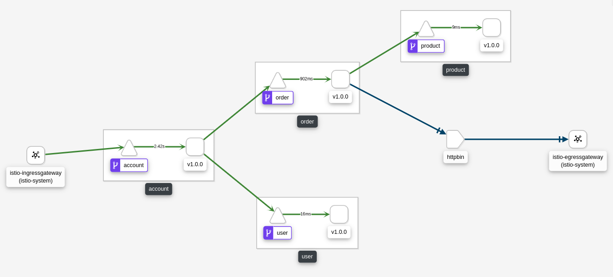
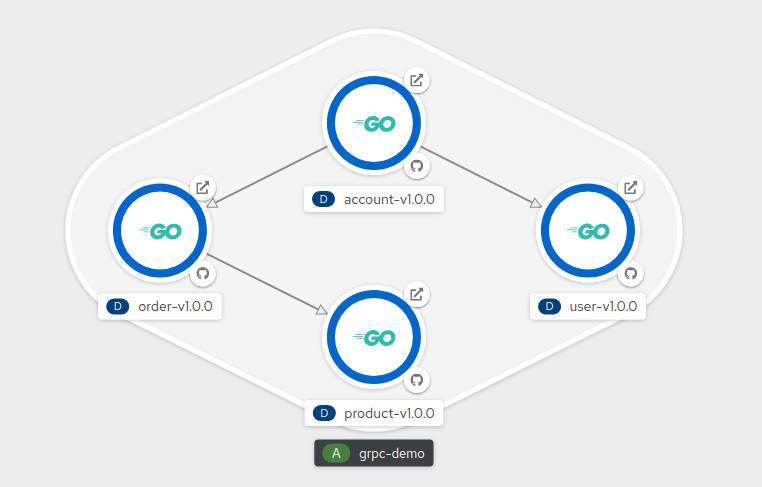
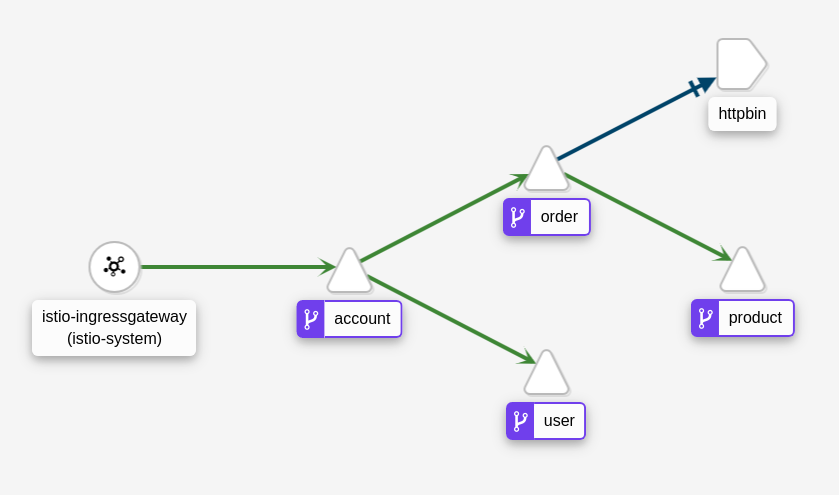
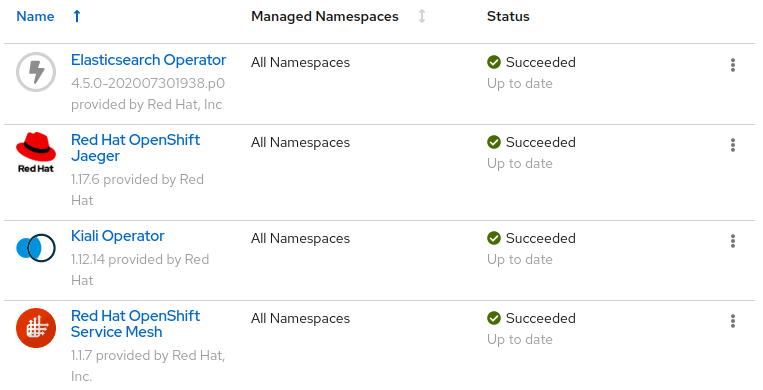
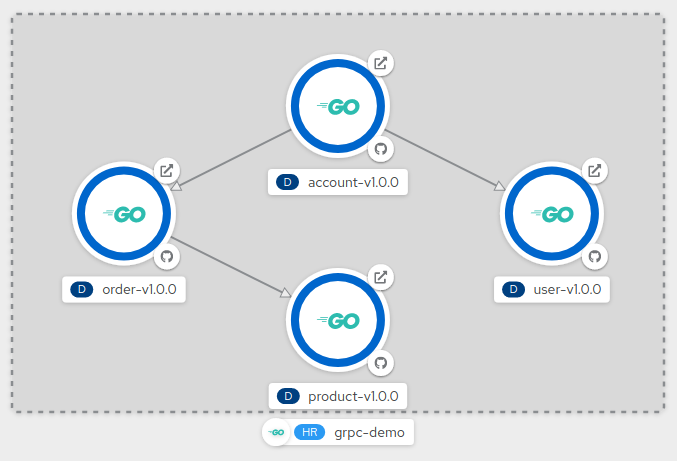
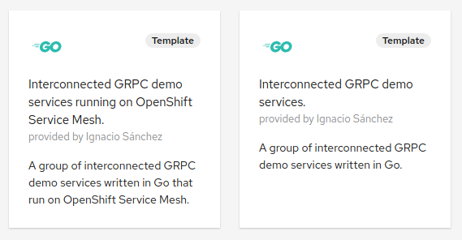
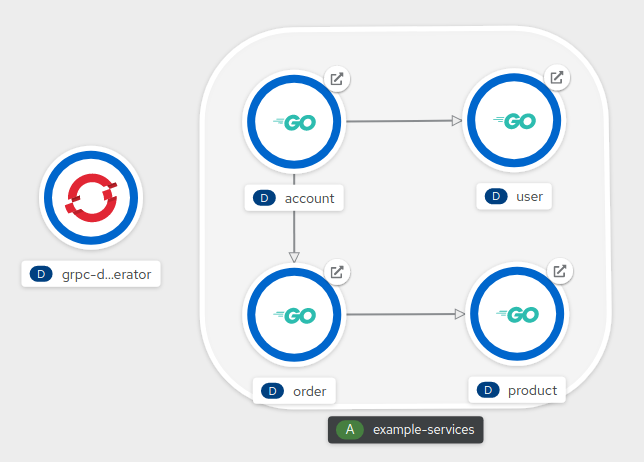
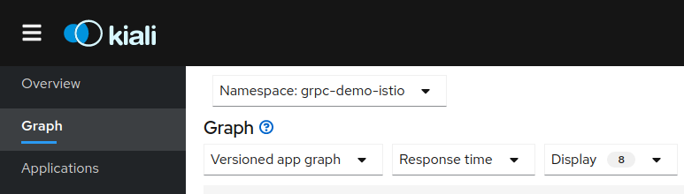
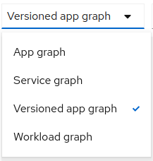
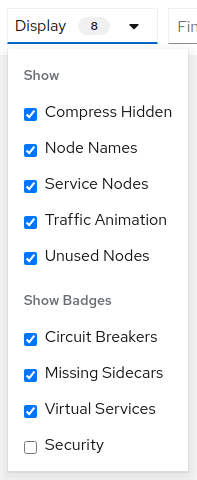

# Istio gRPC Golang Demo



This is a demo to showcase the features of some of the technologies that may be involved in modern microservice development and operation within a Kubernetes platform.

These technologies include [Go](https://golang.org/), [gRPC](https://grpc.io/), [Istio](https://istio.io/), [Helm](https://helm.sh/) and [Kubernetes Operators](https://kubernetes.io/docs/concepts/extend-kubernetes/operator/).

Note that this is just a demo and may not represent the real life. Technologies are mixed but they may not be used all at once. Hopefully, it could help you to understand basic concepts that may be the building blocks to create more complex gRPC microservices in a service mesh.

For deployment, three different mechanisms are provided. You can also choose whether you use Istio or not.

All the examples are provided for Red Hat OpenShift but could be applied to any Kubernetes distribution. If you want to run OpenShift on your laptop you may want to try [Red Hat CodeReady Containers](https://developers.redhat.com/products/codeready-containers/overview).

## Index

1. [Components](#1---components)
2. [Architecture](#2---architecture)
    - [Demo API](#demo-api)
3. [gRPC services in Go](#3---grpc-services-in-go)
    - [Protocol Buffers](#protocol-buffers)
    - [Go Implementation](#go-implementation)
    - [Testing the Services](#testing-the-services)
4. [Istio Service Mesh in OpenShift](#4---istio-service-mesh-in-openshift)
5. [Helm Charts](#5---helm-charts)
    - [Package and distribute a Helm Chart](#package-and-distribute-a-helm-chart)
    - [Deploy the demo using a Helm Chart (with Istio)](#deploy-the-demo-using-a-helm-chart-with-istio)
    - [Deploy the demo using a Helm Chart (without Istio)](#deploy-the-demo-using-a-helm-chart-without-istio)
6. [OpenShift Templates](#6---openshift-templates)
    - [Deploy the demo using an OpenShift Template (with Istio)](#deploy-the-demo-using-an-openshift-template-with-istio)
    - [Deploy the demo using an OpenShift Template (without Istio)](#deploy-the-demo-using-an-openshift-template-without-istio)
7. [Kubernetes Operators](#7---kubernetes-operators)
    - [Demo Operator](#demo-operator)
    - [Deploy the demo using a Kubernetes Operator (without Istio)](#deploy-the-demo-using-a-kubernetes-operator-without-istio)   
8. [Observability with Kiali](#8---observability-with-kiali)

## 1 - Components

- Services
  - [Protobuf Repo](https://github.com/drhelius/grpc-demo-proto)
  - [Account Service](https://github.com/drhelius/grpc-demo-account)
  - [Order Service](https://github.com/drhelius/grpc-demo-order)
  - [Product Service](https://github.com/drhelius/grpc-demo-product)
  - [User Service](https://github.com/drhelius/grpc-demo-user)
- Deployment
  - [Helm Charts](helm-charts)
  - [OpenShift Templates](openshift-templates)
  - [Kubernetes Operator](https://github.com/drhelius/grpc-demo-operator)
- Istio
  - [Service Mesh Control Plane](openshift-service-mesh)

## 2 - Architecture



This demo is composed of four microservices modeling how a customer buy products in an eCommerce:

- [Account](https://github.com/drhelius/grpc-demo-account): Models a user account. This is a composite that aggregates data about the user personal information and product orders made.
- [Order](https://github.com/drhelius/grpc-demo-order): This is a group of products ordered by the user in a single transaction.
- [User](https://github.com/drhelius/grpc-demo-user): The user personal information.
- [Product](https://github.com/drhelius/grpc-demo-product): A description of a product in the store including price an details.

All four microservices are written in Go using gRPC as the main communication framework. Additionally, an HTTP (REST) listener is also provided for each of them. 

In addition to this four services, the *Order* service uses [`httpbin.org`](https://httpbin.org) for simulating service calls to external resources.

The demo can be setup using Istio or without using it.

Three deployment methods are provided for demonstration purposes, you are not expected to use them all at once:

- Helm Chart
- OpenShift Template
- Kubernetes Operator

Note that, for simplicity, the operator is only provided for deploying the demo microservices without Istio.

You can have the services deployed both with Istio and without it at the same time but you may want to deploy them in different namespaces.

All three deployment methods will create the necessary Kubernetes resources to run all four microservices. These resources are `Deployments`, `Services` and `Routes`. If you are running the demo with Istio, they will also create `VirtualServices`, `DestinationRules`, `Gateways` and `ServiceEntries`.

### Demo API



#### Account Service
      
The *Account* service is the entry point. It aggregates data from *User* and *Order* services. When you query the *Account* service it calls *User* and *Order* services under the hood. It represents an user account with personal information and past orders.

- Account
  - Create
    - Request:
      - string id: The account ID
      - User user: The user data
      - Order Array orders: List of orders made
    - Response:
      - string id: The new created account ID
  - Read
    - Request:
      - string id: The account ID
    - Response:
      - string id: The account ID
      - User user: The user data
      - Order Array orders: List of orders made
     
#### Order Service

The *Order* service simulates a collection of products purchased at the same time. When you query the *Order* service it calls *Product* service under the hood.
 
- Order
  - Create
    - Request:
      - string id: The order ID
      - string name: A name for the order
      - int date: The date when order was made
      - Product Array: List of purchased products
      - string ip: Public IP collected during the purchase, just for testing httpbin.org    
    - Response:
      - string id: The new created order ID
  - Read
    - Request:
      - string id: The order ID
    - Response:
      - string id: The order ID
      - string name: A name for the order
      - int date: The date when order was made
      - Product Array: List of purchased products
      - string ip: Public IP collected during the purchase, just for testing httpbin.org
     
#### Product Service

The *Product* service is just a representation of a single product information.

- Product
  - Create
    - Request:
      - string id: The product ID
      - string name: Product name
      - string description: Product description
      - int price: Product price
    - Response:
      - string id: The new created product ID
  - Read
    - Request:
      - string id: The product ID
    - Response:
      - string id: The product ID
      - string name: Product name
      - string description: Product description
      - int price: Product price

#### User Service

The *User* service simulates personal information data.

- User
  - Create
    - Request:
      - string id: The user ID
      - string name: User name
      - string email: User email
    - Response:
      - string id: The new created user ID
  - Read
    - Request:
      - string id: The user ID
    - Response:
      - string id: The user ID
      - string name: User name
      - string email: User email
      
## 3 - gRPC services in Go

gRPC is a framework to connect services by using *Remote Procedure Calls*, this means that a client application can directly call a method on a server application on a different machine as if it were a local object.

It works across languages and platforms and it is increasingly being used in high performance environments. Its protocol can achieve bi-directional streaming with HTTP2 based transport.

gRPC uses [Protocol Buffers](https://developers.google.com/protocol-buffers/docs/overview) (*protobuf* files) to define the structure for the data you want to transfer.

### Protocol Buffers

Before diving into the code let examine the *protobuf* files that define the API used in this demo. There is a shared Git repository where all proto files are defined:

- [grpc-demo-proto](https://github.com/drhelius/grpc-demo-proto)

This Git repo stores the proto files for all the services in the demo. Some services (*Account* and *Order*) work like composites. This mean they will aggregate information from other services (*User* and *Product*). In order to do that they share some common types. Sharing a repo with all the proto files let you share types between different proto files easily.

If you need to share data types, sharing a Git repo for all services or creating a repo for each service is a difficult and hairy decision. This demo will stick with a single repo approach for simplicity.

There is a directory for each service in the repo. In each directory there is a proto file describing the data types that will be used in the service. This is the *User* proto file:

```proto
syntax = "proto3";
option go_package = "github.com/drhelius/grpc-demo-proto/user";

package user;

import "google/api/annotations.proto";

service UserService {
    rpc Create (CreateUserReq) returns (CreateUserResp) {
        option (google.api.http) = {
            post: "/v1/user"
            body: "user"
        };
    }
    rpc Read (ReadUserReq) returns (ReadUserResp) {
        option (google.api.http) = {
            get: "/v1/user/{id}"
        };
    }
}

message User {
    string id = 1;
    string name = 2;
    string email = 3;
}

message CreateUserReq {
    User user = 1;
}

message CreateUserResp {
    string id = 1;
}

message ReadUserReq {
    string id = 1;
}

message ReadUserResp {
    User user = 1;
}
```

In this proto file a service called `UserService` is described. The service has two *methods*, `Create` and `Read`. Each *method* use *messages* to transfer data. 

The `Read` *method* uses the `ReadUserReq` message as input and `ReadUserResp` as output. `ReadUserReq` is defined as a simple data structure with a single string that represents the User *id*. `ReadUserResp` is defined with a field called *user* of type `User`.

The type or *message* `User` is defined as a group of three strings, *id*, *name* and *email*.

In summary, the `Read` *method* expects a user ID and returns the user data.

Note that this proto file is *importing* `google/api/annotations.proto` to annotate each *method* in the service with `option (google.api.http)`. This annotation let you [transcode HTTP to gRPC](https://cloud.google.com/endpoints/docs/grpc/transcoding) and vice versa, so that clients can access your gRPC API by using HTTP/JSON:

```proto
...
        option (google.api.http) = {
            post: "/v1/user"
            body: "user"
        };

...

        option (google.api.http) = {
            get: "/v1/user/{id}"
        };
...
```

So, to create a new User using HTTP you will `POST` the JSON data to `/v1/user`. For retrieving User data you will `GET` from `/v1/user/{id}`.

This is done by using a [gRPC Gateway](https://github.com/grpc-ecosystem/grpc-gateway). This gateway will pass all the messages to the gRPC server and transcode all inputs and outputs to HTTP/JSON.

HTTP transcoding is not required in gRPC but it lets you mix gRPC with RESTful services. In this demo it lets you use simple `curl` commands for testing the services. Note that there is a [`grpcurl`](https://github.com/fullstorydev/grpcurl) tool too.

This is the *Account* proto file:

```proto
syntax = "proto3";
option go_package = "github.com/drhelius/grpc-demo-proto/account";

package account;

import "google/api/annotations.proto";
import "user/user.proto";
import "order/order.proto";

service AccountService {
    rpc Create (CreateAccountReq) returns (CreateAccountResp) {
        option (google.api.http) = {
            post: "/v1/account"
            body: "account"
        };
    }
    rpc Read (ReadAccountReq) returns (ReadAccountResp) {
        option (google.api.http) = {
            get: "/v1/account/{id}"
        };
    }
}

message Account {
    string id = 1;
    user.User user = 2;
    repeated order.Order orders = 3;
}

message CreateAccountReq {
    Account account = 1;
}

message CreateAccountResp {
    string id = 1;
}

message ReadAccountReq {
    string id = 1;
}

message ReadAccountResp {
    Account account = 1;
}
```

The *Account* proto file uses even more imports: `user/user.proto` and `order/order.proto`. Importing other proto files lets you use the *messages* defined in those files in your current proto file.

The *Account* service uses the messages from *User* and *Order* services because it aggregates information from both:

```proto
message Account {
    string id = 1;
    user.User user = 2;
    repeated order.Order orders = 3;
}
```

The keyword `repeated` indicates that the `orders` field can be repeated any number of times (including zero).

Once you have defined your proto files you will use the `protoc` protocol buffer compiler to generate service interface code and stubs in your chosen language.

In the Git proto repository there is a [`build.sh`](https://github.com/drhelius/grpc-demo-proto/blob/master/build.sh) script to compile all the proto files:

```shell
GOOGLE_APIS=${GOPATH}/src/github.com/grpc-ecosystem/grpc-gateway/third_party/googleapis

for proto in user product order account
do
  echo "Removing ${proto}/*.go"
  rm -f ${proto}/*.go
  echo "Generating ${proto}/${proto}.go"
  protoc -I . -I ${GOOGLE_APIS} --go_out=paths=source_relative,plugins=grpc:. ${proto}/${proto}.proto
  echo "Generating ${proto}/${proto}.gw.go"
  protoc -I . -I ${GOOGLE_APIS} --grpc-gateway_out=paths=source_relative:. ${proto}/${proto}.proto
done
```

Because we are using the additional `google.api.http` API to transcode HTTP we need to tell `protoc` where to look for the [gRPC Gateway implementation](https://github.com/grpc-ecosystem/grpc-gateway).

The generated code is also committed to this repo so we can use it later as a Go dependency in the service implementation. There are two generated files, `${proto}.go` for normal client/server gRPC code and `${proto}.gw.go` for the HTTP gateway.

In order to use the `protoc` tool you need to install it runnning this commands before. Refer to the [official documentation](https://grpc.io/docs/languages/go/quickstart/) for more information:

```shell
$ export GO111MODULE=on  # Enable module mode
$ go get github.com/golang/protobuf/protoc-gen-go
$ export PATH="$PATH:$(go env GOPATH)/bin"
```

### Go Implementation

All four services are implemented in the same way.

In `main.go` two goroutines are created for both serving gRPC and HTTP:

```go
func main() {
	var wg sync.WaitGroup

	wg.Add(1)
	go grpc.Serve(&wg, "5000")

	wg.Add(1)
	go http.Serve(&wg, "5000", "8080")

	wg.Wait()
}
```

gRPC server is quite straightforward. It uses the code generated by `protoc` and imported from the proto files Git repository:

```go
func Serve(wg *sync.WaitGroup, port string) {
	defer wg.Done()

	lis, err := net.Listen("tcp", ":"+port)

	if err != nil {
		log.Fatalf("[User] GRPC failed to listen: %v", err)
	}

	s := grpc.NewServer()

	user.RegisterUserServiceServer(s, &impl.Server{})

	log.Printf("[User] Serving GRPC on localhost:%s ...", port)

	if err := s.Serve(lis); err != nil {
		log.Fatalf("[User] GRPC failed to serve: %v", err)
	}
}
```

The HTTP server is a little bit more complex because, in reality, it is a [gRPC Gateway](https://github.com/grpc-ecosystem/grpc-gateway) as commented before. It needs to know the port where gRPC is serving in order to connect to it, pass it all the messages and transcode all inputs and outputs:

```go
func Serve(wg *sync.WaitGroup, grpc_port string, http_port string) {
	defer wg.Done()

	ctx := context.Background()
	ctx, cancel := context.WithCancel(ctx)
	defer cancel()

	mux := runtime.NewServeMux()
	opts := []grpc.DialOption{grpc.WithInsecure()}
	err := user.RegisterUserServiceHandlerFromEndpoint(ctx, mux, fmt.Sprintf(":%s", grpc_port), opts)
	if err != nil {
		return
	}

	log.Printf("[User] Serving HTTP on localhost:%s ...", http_port)

	http.ListenAndServe(fmt.Sprintf(":%s", http_port), mux)
}
```

You can find the implementation of the server in the `impl` package, it implements the service interface (*methods* and *messages*) defined in the proto file:

```go
type Server struct {
	user.UnimplementedUserServiceServer
}

func (s *Server) Create(ctx context.Context, in *user.CreateUserReq) (*user.CreateUserResp, error) {

	log.Printf("[User] Create Req: %v", in.GetUser())

	r := &user.CreateUserResp{Id: strconv.Itoa(randomdata.Number(1000000))}

	log.Printf("[User] Create Res: %v", r.GetId())

	return r, nil
}

func (s *Server) Read(ctx context.Context, in *user.ReadUserReq) (*user.ReadUserResp, error) {

	log.Printf("[User] Read Req: %v", in.GetId())

	r := &user.ReadUserResp{User: &user.User{Id: in.GetId(), Name: randomdata.FullName(randomdata.RandomGender), Email: randomdata.Email()}}

	log.Printf("[User] Read Res: %v", r.GetUser())

	return r, nil
}
```

Services that calls other services, like the *Account* service, use gRPC clients:

```go
var UserService user.UserServiceClient

func init() {
	log.Printf("[Account] Dialing to 'user:5000' ...")

	keepAliveParams := keepalive.ClientParameters{
		Time:                5 * time.Second,
		Timeout:             time.Second,
		PermitWithoutStream: true,
	}

	conn, err := grpc.Dial("user:5000", grpc.WithInsecure(), grpc.WithBlock(), grpc.FailOnNonTempDialError(true), grpc.WithKeepaliveParams(keepAliveParams))
	if err != nil {
		log.Fatalf("[Account] Error dialing to User service: %v", err)
	}

	UserService = user.NewUserServiceClient(conn)
}
```

### Testing the Services

You can test each service individually but it is easier to test the *Account* service directly as this service will end up calling all the others.

If you are using Istio, the *Account* service will be exposed using an `IngressGateway` and an OpenShift `Route`. If not, only an OpenShift `Route` will be created.

You can invoke the *Account* service with the following command, given that `account-grpc-demo.mycluster.com` is the *fqdn* of your exposed `Route`. You can use any number for the account ID:

`$ curl http://account-grpc-demo.mycluster.com/v1/account/01234`

For your reference, the *Account* service `Read` method response looks similar to this (in JSON):

```json
{
    "account": {
        "id": "01234",
        "user": {
            "id": "261782",
            "name": "Addison Davis",
            "email": "avathompson150@test.com"
        },
        "orders": [
            {
                "id": "523773",
                "name": "Goosebold",
                "date": "319615",
                "products": [
                    {
                        "id": "322704",
                        "name": "Watchertwisty",
                        "description": "She stared at him in astonishment, and as she read something of the significant hieroglyphic of his battered face, her lips whitened.",
                        "price": 164
                    },
                    {
                        "id": "897965",
                        "name": "Slicerdot",
                        "description": "I protest, even warmly, that neither he nor his sorrows were in my intention.",
                        "price": 399
                    },
                    {
                        "id": "575966",
                        "name": "Ladybitter",
                        "description": "The sun set; the dusk fell on the stream, and lights began to appear along the shore. The Chapman light–house, a three–legged thing erect on a mud–flat, shone strongly.",
                        "price": 226
                    }
                ],
                "ip": "0.0.0.0"
            },
            {
                "id": "530053",
                "name": "Shieldpatch",
                "date": "744632",
                "products": [
                    {
                        "id": "298342",
                        "name": "Falconcoconut",
                        "description": "And with that he went off to see my father, taking me with him by the arm.",
                        "price": 495
                    }
                ],
                "ip": "0.0.0.0"
            },
            {
                "id": "842957",
                "name": "Raptorthunder",
                "date": "106101",
                "products": [
                    {
                        "id": "67822",
                        "name": "Pegasusrust",
                        "description": "He completely abandoned the child of his marriage with Adelaida Ivanovna, not from malice, nor because of his matrimoni- al grievances, but simply because he forgot him.",
                        "price": 821
                    },
                    {
                        "id": "173082",
                        "name": "Gemrain",
                        "description": "Have I come to Utopia to hear this sort of thing?",
                        "price": 542
                    }
                ],
                "ip": "0.0.0.0"
            }
        ]
    }
}
```

Keep reading for in-depth information of how to deploy the demo services.

## 4 - Istio Service Mesh in OpenShift

In order to install OpenShift Service Mesh you should go through the steps explained in the [official docs](https://docs.openshift.com/container-platform/4.5/service_mesh/service_mesh_install/preparing-ossm-installation.html). The following is a simplified guide.

Istio in OpenShift is installed by running a set of operators. Before installing the Red Hat Service Mesh operator you have to install the Elasticsearch, Jaeger and Kiali operators, in this order.



### Install Elasticsearch Operator

- Update Channel: 4.5
- Installation Mode: All namespaces
- Installed Namespace: openshift-operators
- Approval Strategy: Automatic

### Install Red Hat OpenShift Jaeger Operator

- Update Channel: stable
- Installation Mode: All namespaces
- Installed Namespace: openshift-operators
- Approval Strategy: Automatic

### Install Kiali Operator (provided by Red Hat)

- Update Channel: stable
- Installation Mode: All namespaces
- Installed Namespace: openshift-operators
- Approval Strategy: Automatic

### Install Red Hat OpenShift Service Mesh operator

- Update Channel: stable
- Installation Mode: All namespaces
- Installed Namespace: openshift-operators
- Approval Strategy: Automatic

### Create istio-system project

With all four required operators installed in your cluster you are ready to deploy Istio.

First create a namespace for the control plane, the name `istio-system` is recommended:

`$ oc new-project istio-system`

### Deploy Service Mesh control plane

Once the project is ready you can create the control plane.

A Service Mesh Control Plane manifest is [provided in this repo](openshift-service-mesh/service-mesh-control-plane.yaml). Use it to bootstrap the installation of Istio in OpenShift:

`$ kubectl apply -f openshift-service-mesh/service-mesh-control-plane.yaml -n istio-system`

Istio operator will then create all the deployments that conform the control plane. After a few minutes it should look like this:

```bash
$ kubectl get deployments -n istio-system
NAME                     READY   UP-TO-DATE   AVAILABLE   AGE
grafana                  1/1     1            1           41d
ior                      1/1     1            1           41d
istio-citadel            1/1     1            1           41d
istio-egressgateway      1/1     1            1           41d
istio-galley             1/1     1            1           41d
istio-ingressgateway     1/1     1            1           41d
istio-pilot              1/1     1            1           41d
istio-policy             1/1     1            1           41d
istio-sidecar-injector   1/1     1            1           41d
istio-telemetry          1/1     1            1           41d
jaeger                   1/1     1            1           41d
kiali                    1/1     1            1           15d
prometheus               1/1     1            1           41d
```

## 5 - Helm Charts



Helm Charts are an easy and powerful tool for deploying your services.

In this demo there are two different charts for deploying the services both with Istio and without it:

- [grpc-demo-services-istio](helm-charts/grpc-demo-services-istio/Chart.yaml)
- [grpc-demo-services](helm-charts/grpc-demo-services/Chart.yaml)

These charts deploy all four services at once. This is convenient for this demo but in real life you may want to isolate each service lifecycle by installing them independently.

A chart is a Helm package where you define [templates](helm-charts/grpc-demo-services-istio/templates) that will be used to create all the resource definitions to run whatever you wish in a Kubernetes cluster.

These templates can contain references to variables, functions, loops and conditionals that will be rendered when the chart is installed.

This example shows a `Gateway` template for the *Account* service. This `Gateway` is part of the Istio configuration in order to expose the service outside the mesh. Note that variables are being used to set up some values. The value of this variables will be provided when the chart is installed:

```yaml
apiVersion: networking.istio.io/v1alpha3
kind: Gateway
metadata:
  labels:
    app: account
    app.kubernetes.io/name: account
    app.kubernetes.io/component: service
    app.kubernetes.io/part-of: {{ .Values.appName }}
    group: {{ .Values.appName }}
  name: account
spec:
  selector:
    istio: ingressgateway
  servers:
  - hosts:
    - {{ .Values.account.route }}
    port:
      name: http2
      number: 80
      protocol: HTTP2
```

You can also provide [default values](helm-charts/grpc-demo-services-istio/values.yaml) for any variable.

Refer to the [official docs](https://helm.sh/docs/topics/charts/) for more information on how to develop a Helm Chart.

### Package and distribute a Helm Chart

Once you have developed a Helm Chart you can make a package and create a Helm repository to distribute it.

Helm repositories are simple web servers that host tgz files. Each chart is distributed as a compressed tgz file. In addition to the charts you need an `index.yaml`. This index will contain the information of the charts in the Helm repo.

In this demo, the Helm repo is provided by using [GitHub Pages](https://pages.github.com/). GitHub let you use a directory in your Git repository to store web content. You can use this directory to store some charts and the `index.yaml` file.

This is the URL for the GitHub pages in this Git repo: <https://drhelius.github.io/grpc-demo/>

If you visit this URL with your browser you will face a 404 as there isn't any web content at all. But Helm knows there is a Helm repository there because it can find the `index.yaml` file: <https://drhelius.github.io/grpc-demo/index.yaml>

Use this commands to compress and package the charts into a tgz file:

```bash
$ helm package helm-charts/grpc-demo-services
$ helm package helm-charts/grpc-demo-services-istio
```

The output will be a tgz file for each chart. Put these tgz files in the same directory. In this same directory you are going to generate the `index.yaml` file too.

Run the following command to create the index. Specify the directory where the tgz files are located and the URL where you are expecting to publish the Helm repo. It will read the directory and generate an index file based on the charts found:

`$ helm repo index docs --url https://drhelius.github.io/grpc-demo/`

Now you can upload the whole directory to your desired web server. Your users can grab your charts by running:

```bash
$ helm repo add grpc-demo https://drhelius.github.io/grpc-demo/
"grpc-demo" has been added to your repositories
```

### Deploy the demo using a Helm Chart (with Istio)

Create a project to deploy the demo services if you haven't done so:

`$ oc new-project grpc-demo-istio`

Create the service mesh [Member Roll](https://docs.openshift.com/container-platform/4.5/service_mesh/service_mesh_install/installing-ossm.html#ossm-member-roll-create_installing-ossm) if you haven't done so. This will tell Istio to start monitoring the namespaces specified.

A Service Mesh Member Roll manifest is [provided in this repo](openshift-service-mesh/service-mesh-member-roll.yaml). It includes the `grpc-demo-istio` namespace. If you are using a different name for the project you should change it accordingly.

Use it to create the Member Roll:

`$ kubectl apply -f openshift-service-mesh/service-mesh-member-roll.yaml -n istio-system`

In this example you are going to use the [provided Helm Chart](helm-charts/grpc-demo-services-istio/Chart.yaml) for deploying the services using Istio.

Make sure you are working with the right namespace:

`$ oc project grpc-demo-istio`

Add the chart repository to your helm client and name it `grpc-demo`:

```bash

$ helm repo add grpc-demo https://drhelius.github.io/grpc-demo/
"grpc-demo" has been added to your repositories

$ helm repo list
NAME        URL
grpc-demo   https://drhelius.github.io/grpc-demo/
```

Make sure you get the latest list of charts:

```bash
$ helm repo update
Hang tight while we grab the latest from your chart repositories...
...Successfully got an update from the "grpc-demo" chart repository
Update Complete. ⎈ Happy Helming!⎈
```

The chart you are going to install is called `grpc-demo-services-istio`. You can inspect the chart before installing it in your cluster:

```bash
$ helm show chart grpc-demo/grpc-demo-services-istio
apiVersion: v2
description: A group of interconnected GRPC demo services written in Go that run on
  OpenShift Service Mesh.
home: https://github.com/drhelius/grpc-demo
icon: https://raw.githubusercontent.com/openshift/console/master/frontend/public/imgs/logos/golang.svg
keywords:
- go
- grpc
- demo
- service
- istio
maintainers:
- email: isanchez@redhat.com
  name: Ignacio Sánchez
  url: https://twitter.com/drhelius
name: grpc-demo-services-istio
sources:
- https://github.com/drhelius/grpc-demo
version: 1.0.0
```

The chart can be parameterized. These are the [default values](helm-charts/grpc-demo-services-istio/values.yaml) for all the parameters:

```yaml
appName: grpc-demo-istio

account:
  image: quay.io/isanchez/grpc-demo-account
  version: v1.0.0
  replicas: 1
  route: account-grpc-demo.mycluster.com

order:
  image: quay.io/isanchez/grpc-demo-order
  version: v1.0.0
  replicas: 1

product:
  image: quay.io/isanchez/grpc-demo-product
  version: v1.0.0
  replicas: 1

user:
  image: quay.io/isanchez/grpc-demo-user
  version: v1.0.0
  replicas: 1

limits:
  memory: "200"
  cpu: "0.5"

requests:
  memory: "100"
  cpu: "0.1"
```

Install the chart using a custom *Account* route. Note that you must provide a valid *fqdn* for the route that is going to expose the *Account* service HTTP listener using an [Ingress Gateway](https://istio.io/latest/docs/tasks/traffic-management/ingress/ingress-control/). This *fqdn* should make sense in your cluster so change `account-grpc-demo.mycluster.com` with a name valid in your cluster:

`$ helm install --set account.route=account-grpc-demo.mycluster.com grpc-demo-istio grpc-demo/grpc-demo-services-istio`

After a few minutes the services should be up an running:

```bash
$ kubectl get deployments
NAME             READY   UP-TO-DATE   AVAILABLE   AGE
account-v1.0.0   1/1     1            1           3m1s
order-v1.0.0     1/1     1            1           3m1s
product-v1.0.0   1/1     1            1           3m1s
user-v1.0.0      1/1     1            1           3m1s
```

You can test the services using HTTP by sending a GET request to the *Account* service (any account ID will do). For simplicity, the starting request will be HTTP but all subsequent requests between services will be GRPC:

`$ curl http://account-grpc-demo.mycluster.com/v1/account/01234`

You can uninstall everything by running:

`$ helm uninstall grpc-demo-istio`

### Deploy the demo using a Helm Chart (without Istio)

Create a project to deploy the demo services if you haven't done so:

`$ oc new-project grpc-demo`

In this example you are going to use the [provided Helm Chart](helm-charts/grpc-demo-services/Chart.yaml) for deploying the services without using Istio.

Make sure you are working with the right namespace:

`$ oc project grpc-demo`

Add the chart repository to your helm client and name it `grpc-demo`:

```bash

$ helm repo add grpc-demo https://drhelius.github.io/grpc-demo/
"grpc-demo" has been added to your repositories

$ helm repo list
NAME        URL
grpc-demo   https://drhelius.github.io/grpc-demo/
```

Make sure you get the latest list of charts:

```bash
$ helm repo update
Hang tight while we grab the latest from your chart repositories...
...Successfully got an update from the "grpc-demo" chart repository
Update Complete. ⎈ Happy Helming!⎈
```

The chart you are going to install is called `grpc-demo-services`. You can inspect the chart before installing it in your cluster:

```bash
$ helm show chart grpc-demo/grpc-demo-services
apiVersion: v2
description: A group of interconnected GRPC demo services written in Go.
home: https://github.com/drhelius/grpc-demo
icon: https://raw.githubusercontent.com/openshift/console/master/frontend/public/imgs/logos/golang.svg
keywords:
- go
- grpc
- demo
- service
maintainers:
- email: isanchez@redhat.com
  name: Ignacio Sánchez
  url: https://twitter.com/drhelius
name: grpc-demo-services
sources:
- https://github.com/drhelius/grpc-demo
version: 1.0.0
```

The chart can be parameterized. These are the [default values](helm-charts/grpc-demo-services/values.yaml) for all the parameters:

```yaml
appName: grpc-demo

account:
  image: quay.io/isanchez/grpc-demo-account
  version: v1.0.0
  replicas: 1

order:
  image: quay.io/isanchez/grpc-demo-order
  version: v1.0.0
  replicas: 1

product:
  image: quay.io/isanchez/grpc-demo-product
  version: v1.0.0
  replicas: 1

user:
  image: quay.io/isanchez/grpc-demo-user
  version: v1.0.0
  replicas: 1

limits:
  memory: "200"
  cpu: "0.5"

requests:
  memory: "100"
  cpu: "0.1"
```

Install the chart:

`$ helm install grpc-demo grpc-demo/grpc-demo-services`

After a few minutes the services should be up an running:

```bash
$ oc get deployments
NAME             READY   UP-TO-DATE   AVAILABLE   AGE
account-v1.0.0   1/1     1            1           3m1s
order-v1.0.0     1/1     1            1           3m1s
product-v1.0.0   1/1     1            1           3m1s
user-v1.0.0      1/1     1            1           3m1s
```

An HTTP route for every service is automatically generated:

```bash
$ oc get route
NAME      HOST/PORT                                           PATH   SERVICES   PORT   TERMINATION   WILDCARD
account   account-grpc-demo.apps.mycluster.com                 account    http                 None
order     order-grpc-demo.apps.mycluster.com                   order      http                 None
product   product-grpc-demo.apps.mycluster.com                 product    http                 None
user      user-grpc-demo.apps.mycluster.com                    user       http                 None
```

You can test the services using HTTP by sending a GET request to the *Account* service (any account ID will do). For simplicity, the starting request will be HTTP but all subsequent requests between services will be GRPC:

`$ curl http://account-grpc-demo.apps.mycluster.com/v1/account/01234`

You can uninstall everything by running:

`$ helm uninstall grpc-demo`

## 6 - OpenShift Templates
    
OpenShift Templates are a simple tool to deploy services and apply parameterized changes in your cluster. They are not available in other Kubernetes distributions but they are very convenient for simple scenarios if you are using OpenShift.

Unfortunately, these templates lack the dynamism (loops and conditionals) often used to achieve complex deployments. This usually makes Helm a better option. Refer to the [official docs](https://docs.openshift.com/container-platform/4.5/openshift_images/using-templates.html) for additional information.



Two templates are provided in this repo for deploying the demo services both with Istio and without it:

- [grpc-demo-template-istio.yaml](openshift-templates/grpc-demo-template-istio.yaml)
- [grpc-demo-template.yaml](openshift-templates/grpc-demo-template.yaml)

These templates deploy all four services at once. This is convenient for this demo but in real life you may want to isolate each service lifecycle by deploying them independently.

The templates define all the manifests needed in order to get the services deployed and running.

Parameters allow you to configure each service image, version, replicas and resources:

```yaml
...

parameters:
- description: Sets the Application name.
  name: APP_NAME
  displayName: Application name
  value: grpc-demo
- description: Sets the Account Service image.
  name: ACCOUNT_IMAGE
  displayName: Account Service image
  value: quay.io/isanchez/grpc-demo-account
- description: Sets the Account Service version.
  name: ACCOUNT_VERSION
  displayName: Account Service version
  value: v1.0.0
- description: Specifies how many instances of the Account Service to create in the cluster.
  name: ACCOUNT_REPLICAS
  displayName: Account Service replicas
  value: "1"

...
```

The `APP_NAME` parameter is just an identifier to label all the manifests created by the templates and organize the view in the [OpenShift Developer Console](https://developers.redhat.com/blog/2019/10/16/openshift-developer-perspective/).

The `grpc-demo-template-istio.yaml` template expects an additional `ACCOUNT_ROUTE` parameter to expose the *Account* service using an [Ingress Gateway](https://istio.io/latest/docs/tasks/traffic-management/ingress/ingress-control/). Make sure to provide a valid *fqdn* for this route that makes sense in your cluster. The default value `account-grpc-demo.mycluster.com` is just a placeholder and will not work out of the box.

### Deploy the demo using an OpenShift Template (with Istio)

Create a project to deploy the demo services if you haven't done so:

`$ oc new-project grpc-demo-istio`

Create the service mesh [Member Roll](https://docs.openshift.com/container-platform/4.5/service_mesh/service_mesh_install/installing-ossm.html#ossm-member-roll-create_installing-ossm) if you haven't done so. This will tell Istio to start monitoring the namespaces specified.

A Service Mesh Member Roll manifest is [provided in this repo](openshift-service-mesh/service-mesh-member-roll.yaml). It includes the `grpc-demo-istio` namespace. If you are using a different name for the project you should change it accordingly.

Use it to create the Member Roll:

`$ oc apply -f openshift-service-mesh/service-mesh-member-roll.yaml -n istio-system`

In this example you are going to use the [provided OpenShift template](openshift-templates/grpc-demo-template-istio.yaml) for deploying the services using Istio.

Make sure you are working with the right namespace:

`$ oc project grpc-demo-istio`

Add the template to your project:

```bash
$ oc apply -f openshift-templates/grpc-demo-template-istio.yaml
template.template.openshift.io/grpc-demo-istio created

$ oc get template
NAME              DESCRIPTION                                                                        PARAMETERS     OBJECTS
grpc-demo-istio   A group of interconnected GRPC demo services written in Go that run on OpenSh...   18 (all set)   22
```

This template expects a parameter named `ACCOUNT_ROUTE` to expose the *Account* service using an [Ingress Gateway](https://istio.io/latest/docs/tasks/traffic-management/ingress/ingress-control/). Make sure to provide a valid *fqdn* for this route that makes sense in your cluster. The default value `account-grpc-demo.mycluster.com` is just a placeholder and will not work out of the box.

Now, you can use the Developer Console in OpenShift to deploy all the services using this template. You can also use the cli:

```bash
$ oc process -f openshift-templates/grpc-demo-template-istio.yaml -p ACCOUNT_ROUTE=account-grpc-demo.mycluster.com | oc apply -f -
deployment.apps/account-v1.0.0 created
service/account created
virtualservice.networking.istio.io/account created
destinationrule.networking.istio.io/account created
gateway.networking.istio.io/account created
virtualservice.networking.istio.io/account-gateway created
deployment.apps/order-v1.0.0 created
service/order created
virtualservice.networking.istio.io/order created
destinationrule.networking.istio.io/order created
deployment.apps/product-v1.0.0 created
service/product created
virtualservice.networking.istio.io/product created
destinationrule.networking.istio.io/product created
deployment.apps/user-v1.0.0 created
service/user created
virtualservice.networking.istio.io/user created
destinationrule.networking.istio.io/user created
serviceentry.networking.istio.io/httpbin created
gateway.networking.istio.io/httpbin created
destinationrule.networking.istio.io/httpbin created
virtualservice.networking.istio.io/httpbin created
```

After a few minutes the services should be up an running:

```bash
$ oc get deployments
NAME             READY   UP-TO-DATE   AVAILABLE   AGE
account-v1.0.0   1/1     1            1           3m1s
order-v1.0.0     1/1     1            1           3m1s
product-v1.0.0   1/1     1            1           3m1s
user-v1.0.0      1/1     1            1           3m1s
```

You can test the services using HTTP by sending a GET request to the *Account* service (any account ID will do). For simplicity, the starting request will be HTTP but all subsequent requests between services will be GRPC:

`$ curl http://account-grpc-demo.mycluster.com/v1/account/01234`

You can uninstall everything by running:

`$ oc process -f openshift-templates/grpc-demo-template-istio.yaml | oc delete -f -`

### Deploy the demo using an OpenShift Template (without Istio)

Create a project to deploy the demo services if you haven't done so:

`$ oc new-project grpc-demo`

In this example you are going to use the [provided OpenShift Template](openshift-templates/grpc-demo-template.yaml) for deploying the services without using Istio.

Make sure you are working with the right namespace:

`$ oc project grpc-demo`

Add the template to your project:

```bash
$ oc apply -f openshift-templates/grpc-demo-template.yaml
template.template.openshift.io/grpc-demo created

$ oc get template
NAME        DESCRIPTION                                                   PARAMETERS     OBJECTS
grpc-demo   A group of interconnected GRPC demo services written in Go.   17 (all set)   12
```

Now, you can use the Developer Console in OpenShift to deploy all the services using this template. You can also use the cli:

```bash
$ oc process -f openshift-templates/grpc-demo-template.yaml | oc apply -f -
deployment.apps/account-v1.0.0 created
service/account created
route.route.openshift.io/account created
deployment.apps/order-v1.0.0 created
service/order created
route.route.openshift.io/order created
deployment.apps/product-v1.0.0 created
service/product created
route.route.openshift.io/product created
deployment.apps/user-v1.0.0 created
service/user created
route.route.openshift.io/user created
```

After a few minutes the services should be up an running:

```bash
$ oc get deployments
NAME             READY   UP-TO-DATE   AVAILABLE   AGE
account-v1.0.0   1/1     1            1           43s
order-v1.0.0     1/1     1            1           42s
product-v1.0.0   1/1     1            1           42s
user-v1.0.0      1/1     1            1           41s
```

An HTTP route for every service is automatically created:

```bash
$ oc get route
NAME      HOST/PORT                                           PATH   SERVICES   PORT   TERMINATION   WILDCARD
account   account-grpc-demo.apps.mycluster.com                 account    http                 None
order     order-grpc-demo.apps.mycluster.com                   order      http                 None
product   product-grpc-demo.apps.mycluster.com                 product    http                 None
user      user-grpc-demo.apps.mycluster.com                    user       http                 None
```

You can test the services using HTTP by sending a GET request to the *Account* service (any account ID will do). For simplicity, the starting request will be HTTP but all subsequent requests between services will be GRPC:

`$ curl http://account-grpc-demo.apps.mycluster.com/v1/account/01234`

You can uninstall everything by running:

`$ oc process -f openshift-templates/grpc-demo-template-istio.yaml | oc delete -f -`

## 7 - Kubernetes Operators



In this demo, a Kubernetes Operator is provided in order to deploy all four services at once:

- [grpc-demo-operator](https://github.com/drhelius/grpc-demo-operator)

This is convenient for this demo as you will create and manage a simple CRD for deploying all together. In real life though, you may want to isolate each service lifecycle by deploying them independently. An Operator may not be the best solution for deploying services, this Operator is provided for demonstration purposes.

The operator in this demo can only deploy the services without using Istio. Creating Istio custom resources within a Go Operator is more complex and it has been omitted for simplicity. If you are interested, have a look at the [Istio client-go](https://github.com/istio/client-go) project.

A nice way to create an Operator is by using the [Operator SDK](https://sdk.operatorframework.io/). It provides the tools to build, test and package Operators. In addition, it will create the scafolding needed to start writing your operator easily. Check out the [docs](https://sdk.operatorframework.io/docs/) and don't miss the awesome free eBook about [Kubernetes Operators](https://developers.redhat.com/books/kubernetes-operators).

There are three ways to create an Operator using the Operator SDK: Helm, Ansible and Go. The operator in this demo is written in Go. Given the three options, Go is the most powerful but also the most complex out of the three.

Recommended reads before proceeding:

- [Golang Based Operator Tutorial](https://sdk.operatorframework.io/docs/building-operators/golang/tutorial/)
- ['Hello, World' tutorial with Kubernetes Operators](https://developers.redhat.com/blog/2020/08/21/hello-world-tutorial-with-kubernetes-operators/)
- [With Kubernetes Operators comes great responsibility](https://www.redhat.com/en/blog/kubernetes-operators-comes-great-responsibility)
- [Kubernetes Operators Best Practices](https://www.openshift.com/blog/kubernetes-operators-best-practices)
- [5 tips for developing Kubernetes Operators with the new Operator SDK](https://developers.redhat.com/blog/2020/09/11/5-tips-for-developing-kubernetes-operators-with-the-new-operator-sdk/)

### Demo Operator

> These are the steps followed to create the Operator provided in this demo. They are useful if you want to create an Operator from scratch. If you just want to deploy the demo using the Operator provided you can jump straight to [Deploy the demo using a Kubernetes Operator (without Istio)](#deploy-the-demo-using-a-kubernetes-operator-without-istio).

- Install the Operator SDK following the [official docs](https://sdk.operatorframework.io/docs/installation/install-operator-sdk/).

- Create a new project. Note that the example uses `example.com` to group the CRDs, you may use whatever you wish:

```bash
$ mkdir -p $HOME/projects/grpc-demo-operator
$ cd $HOME/projects/grpc-demo-operator
$ operator-sdk init --domain=example.com --repo=github.com/drhelius/grpc-demo-operator
```

- Create a new Custom Resource Definition (CRD) with version `v1` and Kind `DemoServices`. This kind is the name of your new custom CRD, so you can choose a different name if you wish:

```bash
$ operator-sdk create api --group grpcdemo --version v1 --kind DemoServices --resource=true --controller=true
```

- Now you can define the API. The Custom Resource (CR) in this demo defines the services you want to deploy and their resources. It looks like this:

```yaml
apiVersion: grpcdemo.example.com/v1
kind: DemoServices
metadata:
  name: example-services
spec:
  services:
    - name: account
      image: quay.io/isanchez/grpc-demo-account
      version: v1.0.0
      replicas: 1
      limits:
        memory: 200Mi
        cpu: "0.5"
      requests:
        memory: 100Mi
        cpu: "0.1"
    - name: order
      image: quay.io/isanchez/grpc-demo-order
      version: v1.0.0
      replicas: 1
      limits:
        memory: 200Mi
        cpu: "0.5"
      requests:
        memory: 100Mi
        cpu: "0.1"
    - name: product
      image: quay.io/isanchez/grpc-demo-product
      version: v1.0.0
      replicas: 1
      limits:
        memory: 200Mi
        cpu: "0.5"
      requests:
        memory: 100Mi
        cpu: "0.1"
    - name: user
      image: quay.io/isanchez/grpc-demo-user
      version: v1.0.0
      replicas: 1
      limits:
        memory: 200Mi
        cpu: "0.5"
      requests:
        memory: 100Mi
        cpu: "0.1"
```

For each service defined in this CR, the operator will create a `Deployment`, a `Service` and `Route`. This will make each microservice available in your cluster to be consumed.

- The API for the CR is defined in the [`api/v1/demoservices_types.go`](https://github.com/drhelius/grpc-demo-operator/blob/master/api/v1/demoservices_types.go) file:

```go
// DemoServicesSpec defines the desired state of DemoServices
type DemoServicesSpec struct {
	Services []Service `json:"services"`
}

// Service defines the desired state of a Service
type Service struct {
	Name     string    `json:"name"`
	Image    string    `json:"image"`
	Version  string    `json:"version"`
	Replicas int32     `json:"replicas"`
	Limits   Resources `json:"limits"`
	Requests Resources `json:"requests"`
}

// Resources defines the desired resources for limits and requests
type Resources struct {
	CPU    string `json:"cpu"`
	Memory string `json:"memory"`
}
```

- After modifying any `*_types.go` files always run the following command to update the generated code for that resource type:

```bash
$ make generate
```

- Depending on what you want to achieve you will watch a *primary* resource and some *secondary* ones. You can also add predicates to choose what will trigger the reconciler and what will not. This operator watches `DemoServices` as the primary resource. Additionaly it watches `Deployments`, `Services` and `Routes` as secondary resources:

```go
predCR := predicate.Funcs{
	UpdateFunc: func(e event.UpdateEvent) bool {
		// Ignore updates to CR status in which case metadata.Generation does not change
		return e.MetaOld.GetGeneration() != e.MetaNew.GetGeneration()
	},
}
  
err = c.Watch(&source.Kind{Type: &grpcdemov1.DemoServices{}}, &handler.EnqueueRequestForObject{}, predCR)
if err != nil {
	return err
}

...

h := &handler.EnqueueRequestForOwner{
	IsController: true,
	OwnerType:    &grpcdemov1.DemoServices{},
}

predDeployment := predicate.Funcs{
	CreateFunc: func(e event.CreateEvent) bool {
		return false
	},
	UpdateFunc: func(e event.UpdateEvent) bool {
    // Ignore updates to CR status in which case metadata.Generation does not change
		return e.MetaOld.GetGeneration() != e.MetaNew.GetGeneration()
	},
}

err = c.Watch(&source.Kind{Type: &appsv1.Deployment{}}, h, predDeployment)
if err != nil {
	return err
}
```

- You can then add the logic of the controller. The controller in this operator will trigger a *reconcile* when the primary watched resource changes. Then, it will keep the state  defined in it. Additionally, it will trigger when any of the secondary watched resources change, like `Deployments`, `Routes`, and `Services` to also check if they are in the desired state. Finally, it will delete any orphaned resource not owned by any microservice that may be removed from the `DemoService` CR:

```go
func (r *DemoServicesReconciler) Reconcile(req ctrl.Request) (ctrl.Result, error) {
	//_ = context.Background()

	reqLogger := r.Log.WithValues("req.Namespace", req.Namespace, "req.Name", req.Name)

	reqLogger.Info("Reconciling Services")

	instance := &grpcdemov1.DemoServices{}
	err := r.Client.Get(context.TODO(), req.NamespacedName, instance)
	if err != nil {
		if errors.IsNotFound(err) {
			return reconcile.Result{}, nil
		}
		return reconcile.Result{}, err
	}

	for _, srv := range instance.Spec.Services {
		err := r.manageDeployment(instance, srv, reqLogger)
		if err != nil {
			return reconcile.Result{}, err
		}

		err = r.manageService(instance, srv, reqLogger)
		if err != nil {
			return reconcile.Result{}, err
		}

		err = r.manageRoute(instance, srv, reqLogger)
		if err != nil {
			return reconcile.Result{}, err
		}
	}

	err = r.deleteOrphanedDeployments(instance, reqLogger)
	if err != nil {
		return reconcile.Result{}, err
	}

	err = r.deleteOrphanedServices(instance, reqLogger)
	if err != nil {
		return reconcile.Result{}, err
	}

	err = r.deleteOrphanedRoutes(instance, reqLogger)
	if err != nil {
		return reconcile.Result{}, err
	}

	return ctrl.Result{}, nil
}
```

- Build the operator and generate an image. Make sure you have access to the image repository in order to push it. Here is an example with [Quay](https://quay.io/):

```shell
$ make docker-build docker-push IMG=quay.io/isanchez/grpc-demo-operator:v0.0.1
```

- Before running the operator, the CRD must be registered with the Kubernetes apiserver. This will *install* the CRD in your cluster using `kubectl`:

```shell
$ make install
```

- This operator is expected to be run in the `grpc-demo` namespace. You can change it for all resources in `config/default/kustomization.yaml`:

```shell
$ cd config/default/ && kustomize edit set namespace "grpc-demo" && cd ../..
```

- This operator is a namespace-scoped operator. It will watch for CR changes within a namespace. You can provide the namespace to watch using the `WATCH_NAMESPACE` env var in the [operator Deployment manifest](https://github.com/drhelius/grpc-demo-operator/blob/master/config/manager/manager.yaml). In this demo the namespace to be watched is the same as the namespace where the operator is running:

```yaml
env:
- name: WATCH_NAMESPACE
  valueFrom:
    fieldRef:
      fieldPath: metadata.namespace
```

- Run the following to deploy the operator. This will also install the RBAC manifests from [config/rbac](https://github.com/drhelius/grpc-demo-operator/tree/master/config/rbac).

```shell
$ make deploy IMG=quay.io/isanchez/grpc-demo-operator:v0.0.1
```

### Deploy the demo using a Kubernetes Operator (without Istio)

First, clone the [provided Kubernetes Operator](https://github.com/drhelius/grpc-demo-operator) repository:

```bash
$ git clone https://github.com/drhelius/grpc-demo-operator.git
$ cd grpc-demo-operator
```

Create a project to deploy the demo services if you haven't done so:

`$ oc new-project grpc-demo`

Make sure you are working with the right namespace. The operator will run in the `grpc-demo` namespace by default:

`$ oc project grpc-demo`

The repository you just cloned has a [Makefile](https://github.com/drhelius/grpc-demo-operator/blob/master/Makefile) to assist in some operations.

Run this to build and deploy the operator, the CRDs and all required manifests like RBAC configuration:

```bash
$ make install
$ make deploy IMG=quay.io/isanchez/grpc-demo-operator:v0.0.1
```

Make sure the operator is running fine:

```bash
$ kubectl get deployment grpc-demo-operator-controller-manager
NAME                                    READY   UP-TO-DATE   AVAILABLE   AGE
grpc-demo-operator-controller-manager   1/1     1            1           2m56s
```

The operator is watching custom resources with kind `demoservices.grpcdemo.example.com`.

Now you can create your own [custom resource](https://github.com/drhelius/grpc-demo-operator/blob/master/config/samples/grpcdemo_v1_demoservices.yaml) to instruct the operator to create the demo services:

```yaml
apiVersion: grpcdemo.example.com/v1
kind: DemoServices
metadata:
  name: example-services
spec:
  services:
    - name: account
      image: quay.io/isanchez/grpc-demo-account
      version: v1.0.0
      replicas: 1
      limits:
        memory: 200Mi
        cpu: "0.5"
      requests:
        memory: 100Mi
        cpu: "0.1"
    - name: order
      image: quay.io/isanchez/grpc-demo-order
      version: v1.0.0
      replicas: 1
      limits:
        memory: 200Mi
        cpu: "0.5"
      requests:
        memory: 100Mi
        cpu: "0.1"
    - name: product
      image: quay.io/isanchez/grpc-demo-product
      version: v1.0.0
      replicas: 1
      limits:
        memory: 200Mi
        cpu: "0.5"
      requests:
        memory: 100Mi
        cpu: "0.1"
    - name: user
      image: quay.io/isanchez/grpc-demo-user
      version: v1.0.0
      replicas: 1
      limits:
        memory: 200Mi
        cpu: "0.5"
      requests:
        memory: 100Mi
        cpu: "0.1"
```

Create the custom resource by using the provided example:

```bash
$ kubectl apply -f config/samples/grpcdemo_v1_demoservices.yaml
demoservices.grpcdemo.example.com/example-services created
```

After a few minutes the operator should have created all the required objects and the services should be up an running:

```bash
$ kubectl get deployment
NAME                                    READY   UP-TO-DATE   AVAILABLE   AGE
account                                 1/1     1            1           2m14s
grpc-demo-operator-controller-manager   1/1     1            1           14m
order                                   1/1     1            1           2m14s
product                                 1/1     1            1           2m13s
user                                    1/1     1            1           2m13s
```

An HTTP route for every service is automatically created:

```bash
$ kubectl get route
NAME      HOST/PORT                                     PATH   SERVICES   PORT   TERMINATION   WILDCARD
account   account-grpc-demo.apps.mycluster.com                 account    http                 None
order     order-grpc-demo.apps.mycluster.com                   order      http                 None
product   product-grpc-demo.apps.mycluster.com                 product    http                 None
user      user-grpc-demo.apps.mycluster.com                    user       http                 None
```

You can test the services using HTTP by sending a GET request to the *Account* service (any account ID will do). For simplicity, the starting request will be HTTP but all subsequent requests between services will be gRPC:

`$ curl http://account-grpc-demo.apps.mycluster.com/v1/account/01234`

You can uninstall the services by deleting the custom resource and the operator will delete all of them for you:

```bash
$ kubectl delete demoservices.grpcdemo.example.com example-services
demoservices.grpcdemo.example.com "example-services" deleted
```

## 8 - Observability with Kiali


Once you have Istio and the demo services up and running you can observe what is going on in your mesh with Kiali.

First, you need the Kiali route to access the web console:

```bash
$ kubectl get routes -n istio-system
NAME                            HOST/PORT                                                     PATH   SERVICES               PORT    TERMINATION          WILDCARD
grafana                         grafana-istio-system.apps.mycluster.com                              grafana                <all>   reencrypt            None
grpc-demo-istio-account-mjs5x   account-grpc-demo-istio-system.apps.mycluster.com                    istio-ingressgateway   http2                        None
grpc-demo-istio-httpbin-6c9ww   httpbin.org                                                          istio-egressgateway    https   passthrough          None
istio-ingressgateway            istio-ingressgateway-istio-system.apps.mycluster.com                 istio-ingressgateway   8080                         None
jaeger                          jaeger-istio-system.apps.mycluster.com                               jaeger-query           <all>   reencrypt            None
kiali                           kiali-istio-system.apps.mycluster.com                                kiali                  <all>   reencrypt/Redirect   None
prometheus                      prometheus-istio-system.apps.mycluster.com                           prometheus             <all>   reencrypt            None
```

Login into Kiali console and select the `grpc-demo-istio` namespace:



You can choose between different types of graphs:



And you can select what is displayed in the graphs:




